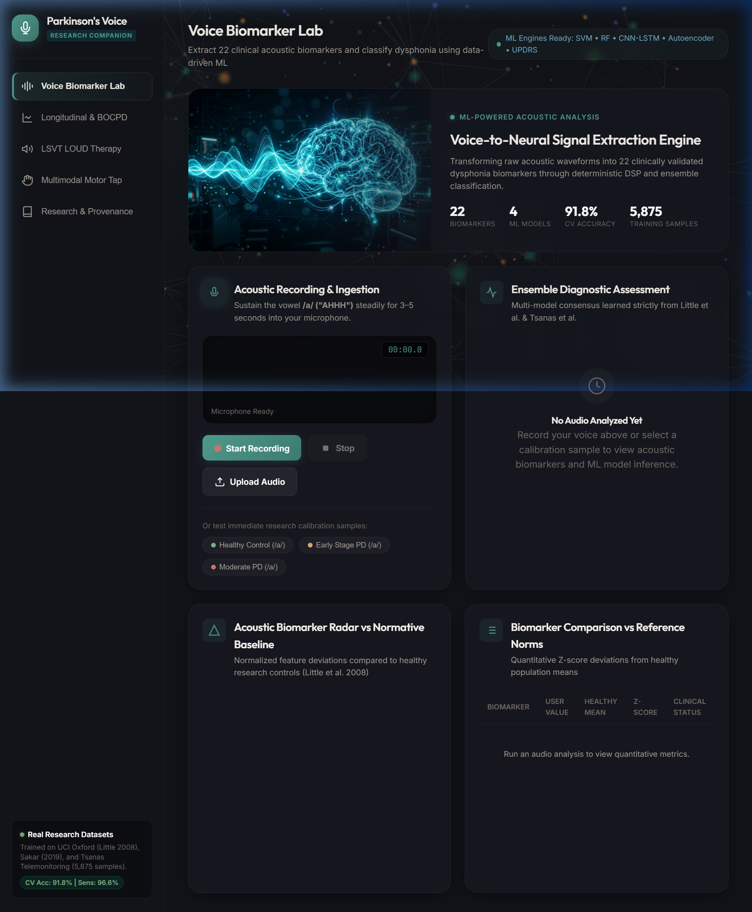

# Parkinson's Voice Companion



A comprehensive, ML-powered clinical web application for Parkinson's Disease (PD) monitoring, early detection, and vocal therapy based on established acoustic/speech biomarkers and multimodal motor analytics.

The dashboard integrates real-time DSP (Digital Signal Processing) with machine learning ensembles to evaluate dysphonia, monitor disease progression, and provide structured therapeutic coaching.

## Features

### 🎙️ 1. Voice Biomarker Lab & Diagnostic Ensemble
Extracts 22 clinically validated acoustic features (e.g., Jitter, Shimmer, Pitch Period Entropy, Harmonics-to-Noise Ratio) directly from a user's microphone.
- **Ensemble ML Classification**: Uses Support Vector Machines (SVM), Random Forests, CNN-BiLSTM networks, and Autoencoders to determine the probability of a Parkinsonian acoustic profile.
- **Normative Baseline Radar**: Visually maps user deviations against healthy clinical baselines (based on datasets from Little et al. 2008 and Sakar et al. 2019).

### 📈 2. Longitudinal Telemonitoring & BOCPD
Monitors acoustic progression over time to predict MDS-UPDRS (Unified Parkinson's Disease Rating Scale) motor severity scores using Tsanas et al.'s telemonitoring models.
- **Bayesian Online Changepoint Detection (BOCPD)**: Automatically detects significant medication state shifts (ON/OFF medication phases) or rapid disease progression based on acoustic entropy.

### 🗣️ 3. LSVT LOUD® Voice Therapy Companion
Provides an interactive biofeedback interface to practice the clinically validated LSVT LOUD® vocal therapy protocol.
- Evaluates sustained phonation duration (MPT), loudness (dB SPL), and fundamental frequency stability.
- Provides immediate visual feedback via an interactive UI gauge to encourage vocal effort and volume maintenance.

### ✋ 4. Multimodal Motor Fluctuation Module
Combines acoustic biomarker data with a browser-based keyboard finger-tapping test (simulating the MDS-UPDRS Item 3.4).
- Assesses tap frequency (Hz), coefficient of variation (rhythmicity), and motor fatigue slope.
- Fuses motor metrics with voice ML probabilities to deliver a holistic composite risk score for detecting motor fluctuations.

### 📚 5. Transparent Research Provenance
Maintains complete traceability to the scientific origins of the models and features used.
- Displays metadata, training sample sizes, and 5-fold cross-validation accuracy metrics from the UCI Oxford, UCI Telemonitoring, and Sakar datasets.

## Technical Stack

- **Backend**: Python 3.13, FastAPI, Librosa & Parselmouth (DSP), Scikit-Learn & NumPy (Machine Learning inference)
- **Frontend**: Vanilla JS, Vanilla CSS, HTML5 Web Audio API
- **Visualization**: Chart.js (Radar & Line charts), Three.js (3D Neural Particle background shaders)
- **UI Design**: Premium clinical glassmorphism aesthetic with desaturated, warm colors (Teal, Sage, Amber, Lavender).

## How to Run Locally

1. **Clone the repository:**
   ```bash
   git clone https://github.com/RaaghavAgarwal28/parkinsons-voice-companion.git
   cd parkinsons-voice-companion
   ```

2. **Install dependencies:**
   ```bash
   pip install fastapi uvicorn librosa soundfile praat-parselmouth scikit-learn numpy scipy
   ```

3. **Start the FastAPI server:**
   ```bash
   cd backend
   python -m uvicorn main:app --host 127.0.0.1 --port 8000
   ```

4. **Access the application:**
   Open your browser and navigate to `http://127.0.0.1:8000/`

## Disclaimer
*This software is an experimental prototype based on research data and is strictly for educational/demonstration purposes. It is not an FDA-approved medical device and should not be used for actual clinical diagnosis or treatment.*
